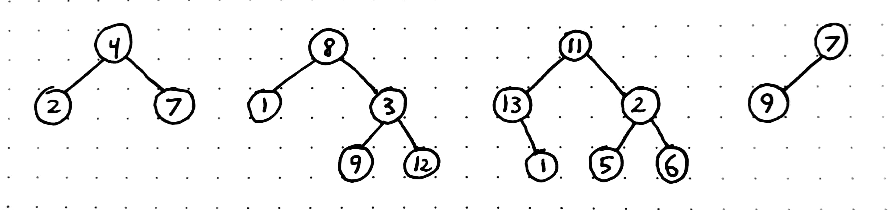
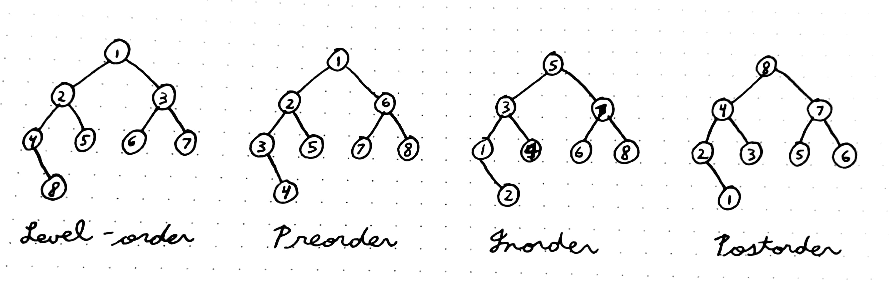

# Binary Tree

A **binary tree** is a hierarchical data structure whose elements have at most two children. Each node in the tree consists of some data and pointers to its two children. These children are often referred to as the *left child* and *right child*. Nodes are connected by directed edges.

The topmost node is called the *root*, and elements with no children are called *leaves*. Nodes that are not leaves are called *internal nodes*.

The *depth* of a node is the number of edges required to get from the root to the node. The *height* of a node is the number of edges from the node to the deepest leaf, and the height of the tree is the height of the root node.

## Uses

Binary trees are useful for storing information that naturally exists in a hierarchy (e.g., a filesystem). The main advantages of binary trees are:
- Decent speed on searches (slower than arrays, but faster than linked lists)
- Decent speed on insertions and deletions (slower than unordered linked lists, but faster than arrays)
- Variable size
- Flexibility; allows movement of subtrees with minimal effort (due to its linked nature)

Common use cases include:
- Manipulating hierarchical data and sorted lists
- Composing digital images
- Router algorithms
- Multi-stage decision making

## Types

There are a few different types of binary trees:
- Full Binary Tree
    - All nodes have zero or two children
    - The number of leaf nodes is equal to the number of internal nodes plus one
- Complete Binary Tree
    - All levels of the tree are completely filled (except maybe the last level)
    - The last level has all nodes as left as possible
- Perfect Binary Tree
    - All internal nodes have two children
    - All leaf nodes are on the same level
    - For a perfect tree of height *h*, there are 2h-1 nodes in total
- Balanced Binary Tree
    - The height of the tree is O(log n), where *n* is the total number of nodes
    - Good for search, insert, and delete performance
- Degenerate/Pathological Binary Tree
    - Every internal node has only one child
    - Essentially the same as a [linked list](linked_list.md)
- Binary Search Tree
    - Efficient way of storing, searching, and retrieving data
    - Nodes are ordered as follows:
        - Each node contains one key (data)
        - All keys in the left subtree are less than the keys in the parent
        - All keys in the right subtree are greater than the keys in the parent
        - No duplicate keys are allowed

## Properties

- The maximum number of nodes at level *l* is 2l-2.
- The maximum number of nodes in a binary tree of height *h* is 2h-1

## Tree Traversals

To **traverse** a binary tree means to visit every node in the structure. There are two primary types of traversal algorithms:
- Depth-first traversal
- Breadth-first traversal

### Breadth-First Traversal

There is only one breadth-first traversal algorithm: **level-order traversal**. In level-order traversal, each node is visited level-by-level from top to bottom, left to right.

### Depth-First Traversal

There are three different depth-first traversal algorithms:
- Preorder Traversal
    - Parent node is visited first, then the left child, then the right child
    - Used to create copies of trees and obtain prefix expressions
- Inorder Traversal
    - The left child is visited first, then the parent, then the right child
    - In a binary search tree, this gives the nodes in non-decreasing order
- Postorder Traversal
    - The left child is visited first, then the right child, then the parent
    - Used to delete a tree or obtain postfix expressions

## Links

- [Carnegie Mellon University - Binary Trees](https://www.cs.cmu.edu/~adamchik/15-121/lectures/Trees/trees.html)
- [Geeksforgeeks - Binary Tree (Set 1)](https://www.geeksforgeeks.org/binary-tree-set-1-introduction/)
