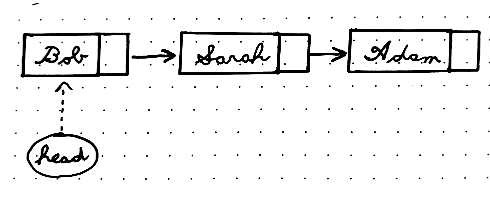

# Linked List

*Note*: on this page there are many mentions of "references" to list nodes. Any mention of a "reference" is to mean that something is referring/pointing to something else, as opposed to being the kind defined by the C++ language specifically.

## What is it?

A **linked list** is a linear data structure similar to arrays. Unlike arrays, items in the list do not need to be stored in contiguous memory locations. Each item in the list is a separate object that holds data and a reference to the next item in the list.

## Why use them?

- Linked lists do not have a fixed size, while arrays do.
- Insering into arrays is expensive because space needs to be created and existing items have to be shifted around

## What are they used for?

- Implementing other data structures (stacks, queues, hash tables, etc.)
- Situations where you need an array without a fixed size

## How they work

### Basic Structure

A linked list can be thought of as a group of **nodes** that are connected to each other. Each node contains data and a reference to the next item in the list. Here is a basic example in C++:

```
struct Node
{
    int data;
    Node *next; // The next item in the list.
};
```

The list also keeps its own, separate reference to the first item. This is called the **head** of the list:

```
class UnorderedList
{
private:
    Node *head;
public:
    UnorderedList();
    ~UnorderedList();
};
```

And here is a representation of what a list looks like:



### Traversal

**Traversal** is the process of visiting nodes in a linked list. To do this, keep a reference/pointer to the head of the list (separate from the list's original) and move it using the `next` pointer in each node:

```
Node *current = head;
while (current != nullptr) {
    // Other code dealing with the current node
    current = current->next;
}
```


## Links
- [geeksforgeeks - Linked Lists](https://www.geeksforgeeks.org/linked-list-set-1-introduction/)
- [pythonds - Implementing Unordered Lists](https://runestone.academy/runestone/books/published/pythonds/BasicDS/ImplementinganUnorderedListLinkedLists.html)
