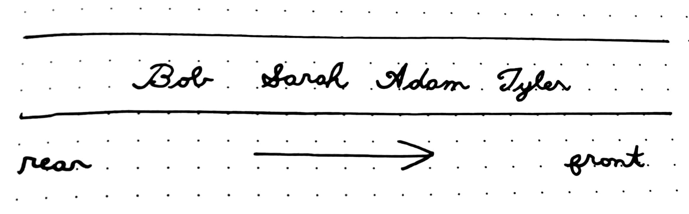

# Queue

## What is it?

A **queue** is an ordered collection of items where insertion of new items is done on one end (called the *front*) and removal is done on the other (called the *rear*).

In a queue, the newest item sits at the rear while the oldest is at the front. As more items are added, the existing items are moved closer to the front. This ordering is called **First-in, First-out (FIFO)**.

## Real World Example

The most common example of using queues is waiting in lines, such as the checkout line in a shop. The person who entered the line first will be at the front and will leave first. As people move through the line, the person who entered last will get closer and closer to the front, until the finally leave and the line is empty.

*In this example, Tyler is at the front of the line and will leave first. Bob will leave last.*

## Examples in Technology

Some things that are implemented using queues are:
- Task scheduling in operating systems
- Serving files to users in the order they made requests
- Print spooling
- Synching data that is transferred between asynchronous processes

## Basic Queue Operations

- `enqueue(item)`: Adds an item to the rear of the queue
- `dequeue()`: Removes an item from the front of the queue (whether the item is returned is implementation-defined)
